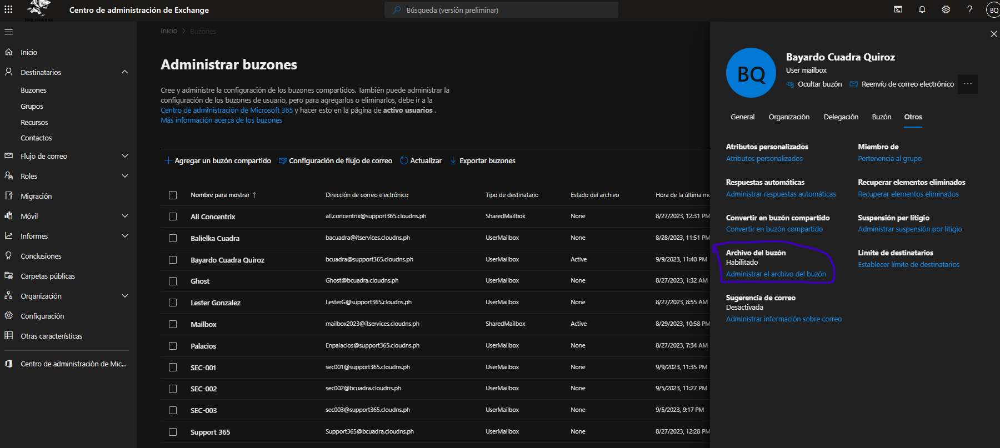

# Enable Exchange Online Mailbox Archiving 

The Auto-Expanding Archive feature in Microsoft 365 allows archive mailboxes to grow automatically once they reach the initial 100 GB storage limit. According to official Microsoft documentation, this feature is available in plans like Exchange Online Plan 2 or Microsoft 365 E3/E5, and can expand up to 1.5 TB per user. For Exchange Online Plan 1, an additional compliance license is required to enable this functionality. It is ideal for organizations with high email volumes and long-term retention needs, as it prevents users from running out of archive space without requiring manual intervention.

## To enable Auto-Expanding Archive in Microsoft 365, follow these steps:

1. In the new EAC, navigate to **Recipients** \> **Mailboxes**.
2. In the list of mailboxes, select the user to enable their mailbox for archive.
3. In the flyout pane, select **Others**, and under **Mailbox archive**, select **Manage mailbox archive**

4.  On the **Manage mailbox archive** pane, turn on **Mailbox archive**, and then **Save**.

### Enable Archive Mailbox - Using PowerShell

    Enable-Mailbox -Identity <username> -Archive
    Disable-Mailbox -Identity <username> -Archive

### Auto-Expanding

However, Microsoft 365 provides auto-expanding archiving for Office 365 Enterprise E3 and E5 licenses. This must be enabled before the archive mailbox reaches its maximum size. When auto-expanding archive is enabled, it can take up to 30 days before free space is added to the archive mailbox.

Run Test: https://aka.ms/PillarArchiveMailbox

    # Enable Unlimited Archiving for the Organization 

    Get-OrganizationConfig | FL AutoExpandingArchiveEnabled

    Set-OrganizationConfig -AutoExpandingArchive

    # Enable Unlimited Archiving for a User Mailbox

    Get-Mailbox -Identity bcuadra@support365.cloudns.ph | FL AutoExpandingArchiveEnabled

    Enable-Mailbox bcuadra@support365.cloudns.ph -AutoExpandingArchive

## If archiving is not working, verify the following statuses.

Using Assist 365, check ELC Status, with "Display Mail User Overview" or :

1.  In compliance \> Data cycle Management \> Check MRM Policy, and Tag. Verify the is no personal.

    
    

2.  Active Litigation Hold.

     

3.  In compliance \> Data cycle management \> Microsoft 365 \> Retention policies. Verify that the user is not in a retention policy. Exclude to mailbox.

     
     

 Wait for the Delayhold police to act. after you remove the user from the hold policy.
 
<!-- -->

    Set-Mailbox Usuario@Dominio.com -RemoveDelayHoldApplied  

Force archive:

    Start-ManagedFolderAssistant -Identity bcuadra@support365.cloudns.ph

Display process:

    Get-MailboxStatistics -Identity bcuadra@support365.cloudns.ph -Archive | Select DisplayName, TotalItemSize, ItemCount

Verify Archive

Until 1.5 TB

[Descripción del servicio de Archivado de Exchange Online - Service Descriptions \| Microsoft Learn](https://learn.microsoft.com/es-es/office365/servicedescriptions/exchange-online-archiving-service-description/exchange-online-archiving-service-description)

[Enable auto-expanding archiving \| Microsoft Learn](https://learn.microsoft.com/en-us/purview/enable-autoexpanding-archiving)''

    Get-MailboxStatistics -Identity bcuadra@support365.cloudns.ph -Archive | Select DisplayName, TotalItemSize, ItemCount

    $logProps = Export-MailboxDiagnosticLogs bcuadra@safe.cloudns.us -ExtendedProperties
    $xmlprops = [xml]($logProps.MailboxLog)
    $xmlprops.Properties.MailboxTable.Property | ? {$_.Name -like "ELC*"}

    Get-MailboxStatistics -Identity bcuadra@safe.cloudns.us -Archive | Select DisplayName, TotalItemSize, ItemCount

    Start-ManagedFolderAssistant -Identity bcuadra@safe.cloudns.us

*\> Autor: Bayardo Cuadra*
